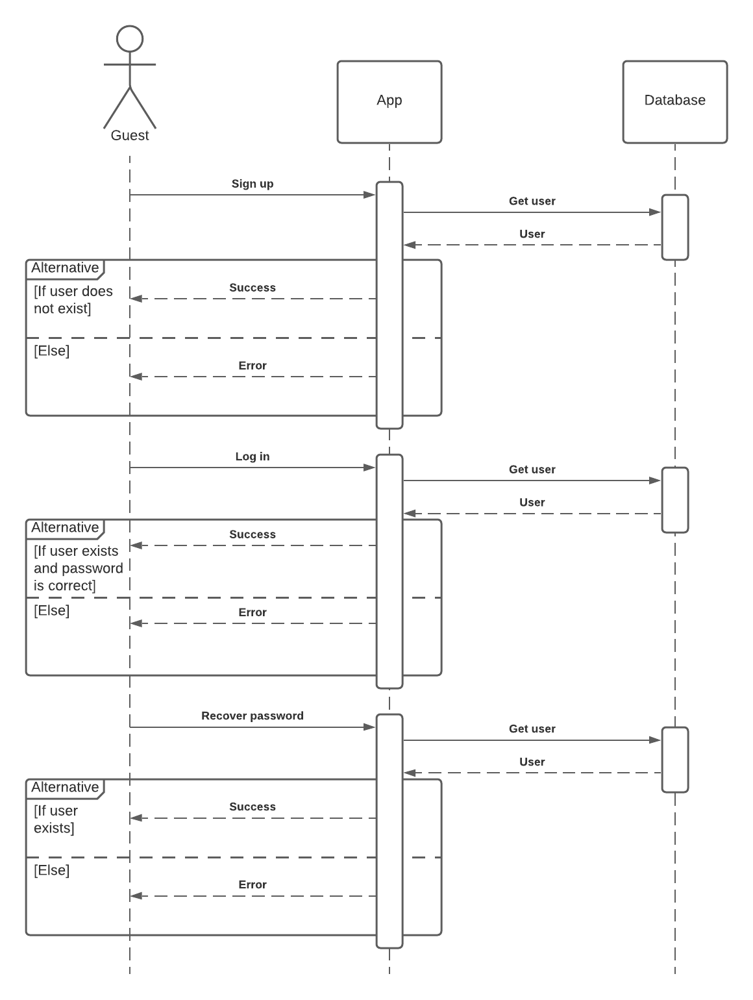
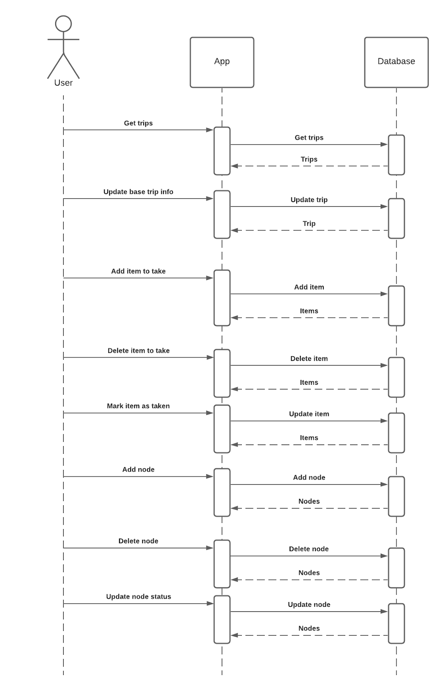
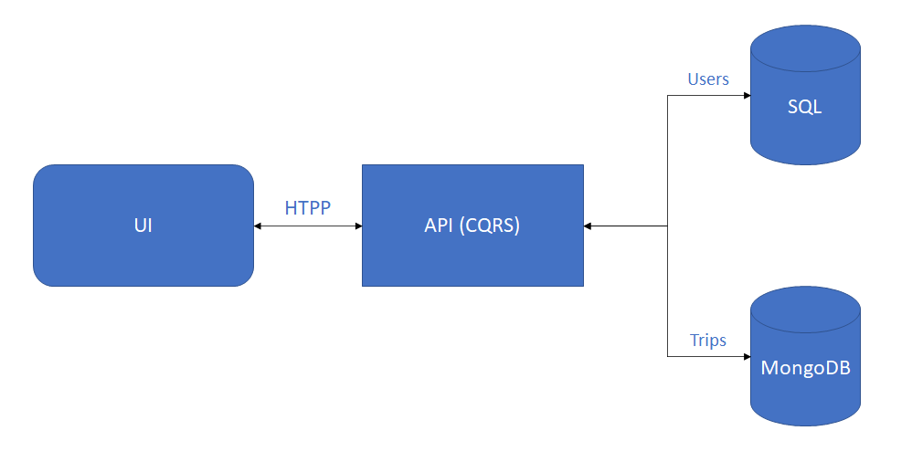
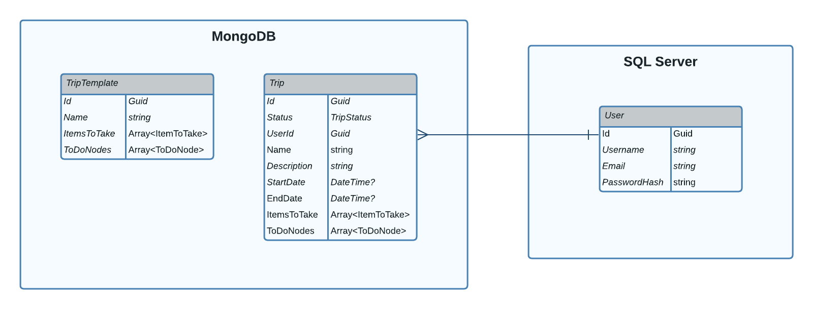

# **TeamOne**

## **Table of Contents**

- [Team](#team)
- [Description](#description)
- [Architecture](#architecture)
- [Storage](#storage)
- [Resiliency model](#resiliency-model)
- [Security model](#security-model)
- [Hosted Service](#hosted-service)
- [Telemetry](#telemetry)
- [Monitoring](#monitoring)

## **Team**

- Zelinskyi Oleksandr
- Romakh Sofiia
- Manokhin Denys
- Bordun Mykhailo
- Kuhar Oleksandr

## **Project Description**

### **Go & See**

This web application is a trip planner which can make organizing your trips easier than it was before. With the assistance of our service user has no need to write down long lists of different items before his journey. All these items will be in one place - our planner, and the only thing that traveler should do before his vacation is to check if he doesn’t forget anything from the list that suggests the Go & See service.

### **Functional description**

The user can create an account and manage it. There will be the next pages for logged-in users: _My profile_ and _Trips_. On the _Trips_ page user can list of trips divided into three stages:

- planned
- in progress
- done

On the same page there will be a possibility to create a new trip from suggested templates:

- sport vacation
- camping vacation
- road trip
- cruise vacation
- resort vacation
- beach vacation
- city vacation
- business trip.

**Use cases**

| Use case                | Description                                                                                                                                                                                                                                                                                                |
| ----------------------- | ---------------------------------------------------------------------------------------------------------------------------------------------------------------------------------------------------------------------------------------------------------------------------------------------------------- |
| Sign up                 | Guest of web system can sign up by filling in next fields: <ul><li>Username</li><li>Email</li><li>Password</li></ul>                                                                                                                                                                                       |
| Log in                  | If the user has created an account he is able to log in to the system, by entering Email and Password that were filled in sign in the form before                                                                                                                                                          |
| Password recovery       | If a user forgot his password he can recover it by entering his email address. Then he will get a letter with the next instructions about password recovery                                                                                                                                                |
| Profile editing         | The user that is logged in the system can edit his personal information, such as Username, Email address and password                                                                                                                                                                                      |
| Trip planning           | The user is able to plan a trip using templates that are suggested by the web system. He needs to choose a template and based on his choice he will get a list of items needed to be done                                                                                                                  |
| Trip preparing          | In the list of items that the user will get after choosing the needed template, he will need to set the date of the trip, choose apartments, book them, buy tickets on transport and do all items that will be suggested by a specific template                                                            |
| Changing trip state     | When a user starts to perform some actions from the template list he can move the trip to the _In progress_ state. While the user is getting ready for the trip he will cross out items that are done. And when all items for the current trip will be done traveler can move the trip to the _Done_ state |
| Adding item to the trip | If there is a necessity in adding one more item to the todo list - the user can easily do it in the trip planning section                                                                                                                                                                                  |

**Use case diagram**


<br/>
<br/>

**Guest sequence diagram**


<br/>
<br/>

**User sequence diagram**


<br/>
<br/>

## **Architecture**

| Part of project | Description                                               | Technologies                  |
| --------------- | --------------------------------------------------------- | ----------------------------- |
| Back end        | API based on CQRS                                         | .NET 5, ASP.Net Core          |
| Fron end        | SPA                                                       | React, Type Script, AntDesign |
| DB              | SQL database for user management and NoSQL for user trips | Azure SQL Database, MongoDB   |

<br/>

<br/>
<br/>

Example of _Trip_ document for MongoDB:

```json
{
  "id": "00000000-0000-0000-0000-000000000000",
  "status": 1,
  "userId": "00000000-0000-0000-0000-000000000000",
  "name": "string",
  "description": "string",
  "startDate": "2021-10-23T17:36:04.432Z",
  "endDate": "2021-10-23T17:36:04.432Z",
  "itemsToTake": [
    {
      "id": "00000000-0000-0000-0000-000000000000",
      "name": "string",
      "isTaken": true
    }
  ],
  "toDoNodes": [
    {
      "id": "00000000-0000-0000-0000-000000000000",
      "name": "string",
      "description": "string",
      "type": 1,
      "date": "2021-10-23T17:36:04.432Z",
      "status": 1
    }
  ]
}
```

Example of _TripTemplate_ document for MongoDB:

```json
{
  "id": "00000000-0000-0000-0000-000000000000",
  "name": "string",
  "itemsToTake": [
    {
      "id": "00000000-0000-0000-0000-000000000000",
      "name": "string",
      "isTaken": true
    }
  ],
  "toDoNodes": [
    {
      "id": "00000000-0000-0000-0000-000000000000",
      "name": "string",
      "description": "string",
      "type": 1,
      "date": "2021-10-23T17:36:04.432Z",
      "status": 1
    }
  ]
}
```

**ER diagram**


<br/>
<br/>

## **Storage**

## **Resiliency Model**

## **Security Model**

## **Hosted Service**

## **Telemetry**

## **Monitoring**
